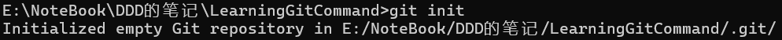
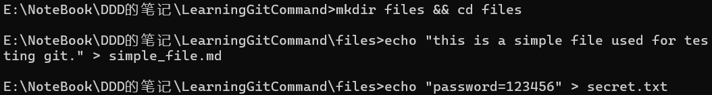
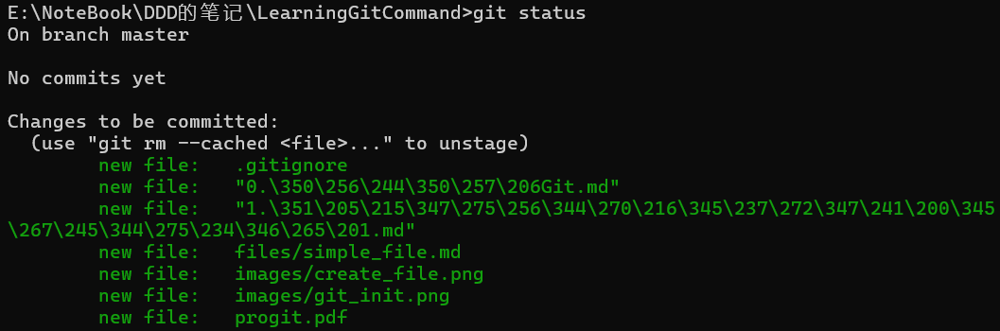
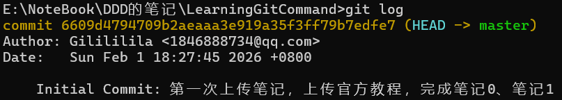

# Git配置
首先，安装Git。在PowerShell中输入`git --version`查询当前版本号，如果看到了版本号，说明安装成功。

Git是一个严谨的系统，每一次修改代码，都需要知道“是谁做的”。这时需要修改**全局配置**，相当于给代码盖上自己的私章。
1. **设置用户名**（这将显示在提交记录中，可以用昵称或者真名）
```Bash
git config --global user.name "你的昵称"
```
2. **设置邮箱**（填写的邮箱最好与注册GitHub的邮箱一致，这样GitHub才能把贡献统计到绿色的格子图中）
```Bash
git config --global user.email "你的邮箱(xxx@xxx)"
```
3. 最后检查一下，使用命令`git config --list`，完成前两步后就能在列表中看到刚刚输入的名字和邮箱。

# 初始化仓库
当我们创建一个新文件夹时，它还不是一个工作区，需要我们使用命令```git init```召唤出Git(初始化Git仓库)。
```Bash
git init
```
运行命令，我们会看到 
说明我们成功初始化了一个Git仓库！

# 创建文件与忽略规则
我们就拥有了一个Git本地仓库，我们可以在这个文件夹下随意的操作了。

我们在这个文件夹下创建一个`files`文件夹，用于存放相关的文件。
新建一个普通的md文件`simple_file.md`，然后创建一个包含了个人信息的文件`secret.txt`


我们需要将`simple_file.md`上传，但是`secret.txt`是我们不希望上传的。
所以我们建立一个`.gitignore`文件并写入规则。通过在`.gitignore`文件中写入文件夹名或者文件名可以让所写的不上传至Git上。
```Bash
touch .gitignore
```
在`.gitignore`文件中写入如下内容，即可让Git忽略`secret.txt`文件。
```
# 忽略secret.txt
files/secret.txt
```

# 第一次快照
完成上述操作后，就可以按照下面的步骤将现有的所有代码保存到仓库中了。
1. **添加到暂存区**
	在代码的根目录下运行下面的代码，将`add`后面的`.`代表根目录下所有的文件都添加到暂存区。
```Bash
git add .
```
此时使用`git status`命令可以查看上传的文件。

2. **提交到本地仓库**
	同样是在根目录下运行，将提交到暂存区的代码永久保存。`-m`后的描述可以根据情况修改，具体见[[x.Git提交规范]]。
```Bash
git commit -m "Initial Commit: 第一次备份笔记，上传官方教程、笔记0、笔记1"
```
如果终端出现`[master (root-commit)...] ... files changed...`，说明提交成功！🎉

# 查看与对比

使用`git log`命令可以查看详细的提交历史，包括提交编号、位置指针、提交作者、提交日期以及提交说明。
