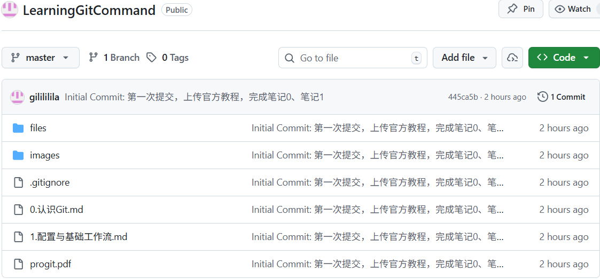

在本地仓库完成代码的提交后，要将仓库上传至GitHub的服务器上，这样别人才能一同协作开发。下面使用SSH协议连接GitHub，配置完成后，以后的推送代码就不需要每次输入密码了。

## 在GitHub上创建一个空仓库
首先需要在GitHub的服务器上准备一个空仓库，用于接收上传的文件。
- **注意**：创建仓库时不能勾选"Add a README file"；不能勾选".gitignore"；不要选择License
- **原因**：本地已经创建了`README`、`.gitignore`文件，如果在GitHub上再创建一次，两边的历史记录不一致，合并时会报错。我们要创建一个**纯净的空仓库**。

## 配置SSH密钥
GitHub需要确认你是账号的主人。我们需要在电脑上生成一对密钥：私钥相当于一把钥匙，存放于自己的电脑中；公钥相当于一把锁，存放于GitHub上。

步骤如下：
1. **生成密钥**：（在终端处输入如下命令，邮箱为注册GitHub时的邮箱）
```Bash
ssh-keygen -C "你的邮箱@xxx.com"
```
2. **一直回车**：系统会依次询问保存的路径、是否设置密码、再次确认密码，一直回车使用默认保存路径、不设置密码。
3. **获取公钥内容**：在`C:\Users\[your_username]`下会生成`.ssh`文件夹，里面包含了公钥和私钥。可以使用命令`cat ~/.ssh/id_rsa.pub`查询公钥
	可以看到以ssh-rsa开头的一长串字符串。将这段字符串完整的复制（包括后面的邮箱）
4. **告诉GitHub你的公钥**：回到GitHub网页，点击右上角头像中的**Settings**，在左侧找到**SSH and GPG keys**，点击绿色的**New SSH key**，**Title**随便填（未来可能使用多设备开发，可以是你的设备标识），**Key**填入刚才复制的公钥，点击**Add SSH key**。

## 本地仓库与在线仓库建立关联
回到自己创建的GitHub仓库界面，在页面中选择**SSH**，复制`git@github.com:...`开头的地址。

在文件根目录的终端处输入如下命令
```Bash
git remote add origin [复制的地址]
```
- `git remote add`用于添加远程连接；
- `origin`是给远程仓库起的**别名**，以后提到`origin`，Git就知道指的是这个GitHub地址。

## 推送到云端
在文件根目录的终端处输入如下命令，就能将以及提交到本地仓库的代码推送到云端。
```Bash
git push -u origin master
```
- `-u`是`--set-upstream`的缩写，意思是“把本地的`master`分支和远程的`origin/master`分支**绑定**起来”，以后只需要输入`git push`，Git就知道要把代码送到哪里；
- `origin master`是把本地的`master`推送到`origin`的`master`。

推送成功后，在终端处会看到如下信息
```
Enumerating objects: 13, done.
Counting objects: 100% (13/13), done.
...
To github.com:gilililila/LearningGitCommand.git
 * [new branch]      master -> master
branch 'master' set up to track 'origin/master'.
```

现在刷新GitHub网页，应该能看到之前使用`git commit`的内容了。